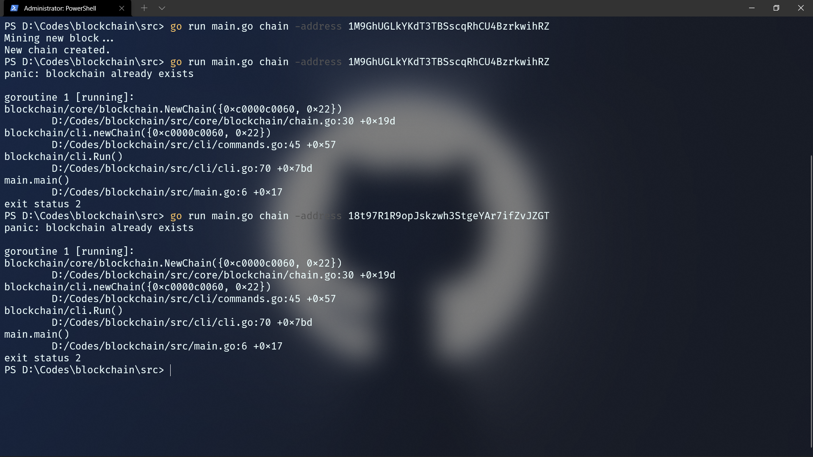
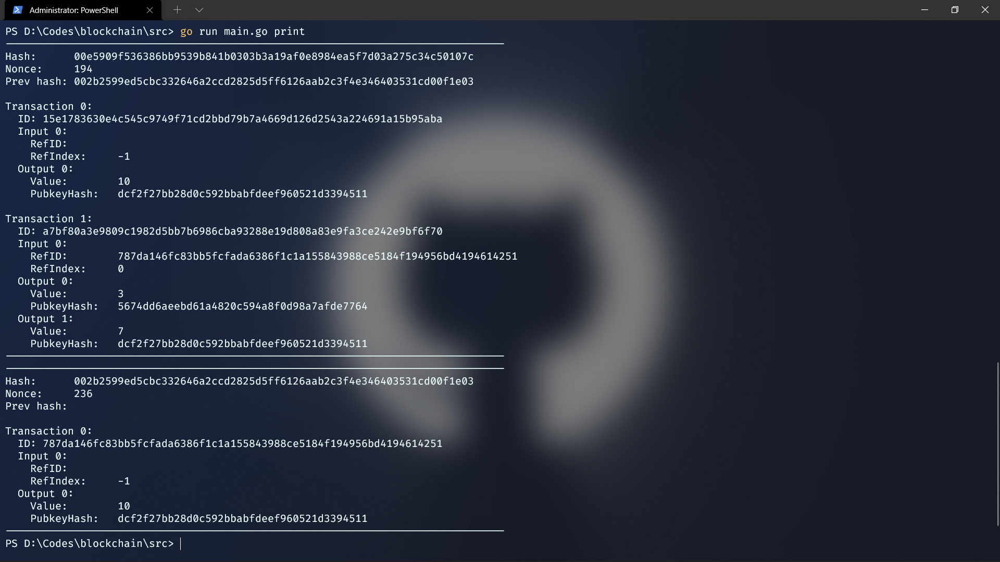

# 一、概述

## 1.1 项目特点

作为一个简单的区块链，该项目实现了以下几项基本功能：

- [x] 挖矿与奖励
- [x] 交易
- [x] 钱包与余额查询
- [x] 默克尔树
- [x] 命令行操作
- [ ] 网络与自动化

## 1.2 包结构

为了增强源码的可读性、逻辑性，我们可以根据代码实现的功能，分类出如下几个包：

```txt
blockchain
	├─ cli				命令行界面
	├─ core
	│    ├─ block		区块
	│    ├─ blockchain	区块链
	│    ├─ merkle		默克尔树
	│    ├─ transaction	交易
	│    └─ wallet		钱包
	├─ utils			工具
	└─ main.go			入口
```

# 二、基本原理

## 2.1 区块

区块是区块链的一个基本单元，保存着基于区块链的交易的信息。

### 2.1.1 数据结构

本项目实现的区块具有以下的结构：


代码概览如下：

```Go
type Block struct {
	Timestamp     int64
	Transactions  []*Transaction
	PrevBlockHash []byte
	Hash          []byte
	Nonce         int
}
```

当我们创建一个区块时，我们需要给出：

- 前一区块的哈希值：用于和前一个区块挂钩，以形成链式结构。
- 交易数据：保存在区块中，供所有人检验与引用。

> 创世块没有前一个区块，所以前一区块的哈希值留空。

之后，程序会自动通过“工作量证明”计算出其余部分，并最终形成新的区块。

### 2.1.2 工作量证明

工作量证明，是矿工们夜以继日做着的事情——成为区块的打包者能够获得奖励，而这一奖励的获得门槛就是工作量证明。它的目标是：计算区块数据的哈希值，最终让其小于某一个特定的数。

由于前一区块哈希值、时间戳、交易数据都是固定的，所以我们需要添加一个自增的随机变量，并在其自增的过程中，找到能够让区块哈希满足条件的值。一旦找到了这个随机数和哈希，工作量证明就完成了，区块的数据也完整了，挖矿也就成功了。

## 2.2 区块链

正因为区块中存储着交易的信息，所以区块链具有了存储财产的功能。

### 2.2.1 数据结构

区块链的结构有些像链栈：运行时只保存最后一个区块的哈希值，剩余所有的信息都存储在数据库中。代码概览如下：

```Go
type Chain struct {
	rear []byte
	db   *bolt.DB
}
```

### 2.2.2 添加区块

由于区块链已经“自己知道”最后区块的哈希值，所以我们只要指定交易数据就可以。然后我们需要经历这几步：

1. 验证每一笔交易的合法性；
2. 获取最后一个区块的哈希值；
3. 挖出这个区块；
4. 加入数据库。

## 2.3 钱包

每个用户有一个钱包，其地址就代表着用户在区块链中的身份。


### 2.3.1 数据结构

钱包里存放的不是实际的财产，而是公钥-私钥的密钥对。代码概览如下：

```Go
type wallet struct {
	Privkey ecdsa.PrivateKey
	Pubkey  []byte
}
```

其中私钥采用椭圆加密算法得出，只有钱包拥有者本人知道；公钥基于私钥产生，所有人都能看到。

### 2.3.2 加密-解密

为了确保交易的货币只有接收方才能使用，而不是落入旁人手中，发送方会采用自己的公钥锁定这笔交易，这把锁需要适配的私钥才能打开。

对应地，在接收方花钱的时候，他需要用自己的私钥去区块链中逐区块尝试开锁；只有能解锁的财产，才是属于自己的。

### 2.3.3 签名-验证

发送方在发送一笔交易时，需要对这笔交易进行数字签名，这既可以确保数据不被篡改，也可以表明发起方的身份。

对应地，在验证交易时，矿工也可以由此确认这笔交易的合法性。

由于一笔交易存入的区块有很多人在挖，所以有多少人在挖这个区块，就相当于交易的合法性经受了多少人的检验，这也是区块链安全性的根源。

## 2.4 交易

交易是区块链中货币流通的手段，也是新区块产生的途径。

### 2.4.1 数据结构

代码概览如下：

#### 2.4.1.1 输入

```Go
type TxInput struct {
	RefID     []byte
	RefIndex  int
	Signature []byte
	Pubkey    []byte
}
```

输入需要引用之前的交易输出，以证明自己花的钱是有来源的，而不是杜撰出来的；同时如上文所述，还需要给出发起方的签名与公钥，供所有人检验。

#### 2.4.1.2 输出

```Go
type TxOutput struct {
	Value      int
	PubkeyHash []byte
}
```

币值，也就是“要给接收方多少钱”；公钥哈希值如上文所说，用于锁定输出。**输出是区块链中，财产的实际存放处。**

#### 2.4.1.3 交易

```Go
type Transaction struct {
	ID      []byte
	Inputs  []*TxInput
	Outputs []*TxOutput
}
```

交易由 ID、输入和输出三部分组成。

### 2.4.2 UTXO 交易

如同现实生活，要有交易的发生，必然先需要有足够的余额。

发起方要先在区块链中，逐个找到自己能够解锁的输出，直到足够支付本次的交易，然后将其存储进这笔交易的输入中。然后，将接收方注册为这笔交易的输出；如果有找零，就将找零也作为一笔输出，只是目标地是自己。

所以实际上，财产并没有发生 P2P 的转移，只是某笔财产的挂名从发起方变成了接收方。也因此，接收方并不需要主动地去接收这笔钱，这笔钱就能自动挂到接收方的名下。

### 2.4.3 coinbase 交易

如果说 UTXO 交易好比现实生活中的财产再分配，那么 coinbase 交易就好比国家印发新钞，产生新的货币。我们需要“凭空”产生一些钱，才能进行后续的 UTXO 交易；这样“凭空”的交易，就是 coinbase 交易。

作为货币的根源，它没有输入，只有一个输出——用于奖励挖出它的人。

# 三、测试结果

该项目根据上面的基本原理，完成了区块链的基础功能，展示如下。

## 3.1 钱包创建与展示


在本测试中，我们先使用 `wallet` 命令创建三个钱包，然后使用 `list` 命令列出当前所有钱包的地址。可以看到，基于文件读写的钱包创建与展示都是成功的。

## 3.2 区块链创建



在本测试中，我们将先后对三个不同的地址使用 `chain` 命令。第一次使用时，区块链被成功创建，创世块被挖出；之后的第二次、第三次中，由于数据库已经存在，创建过程均抛出了错误，与我们预期的一致。

## 3.3 交易

在本测试中，我们将从三个角度对交易进行测试。

首先，我们会测试正常的交易：从一个拥有10元的钱包，向另一个拥有0元的钱包，转账3元。


可以看到，交易成功地完成了，在此过程中有新块被挖出；发送方由于挖出了新块，获得了10元的奖励，最终余额为$10-3+10=17$元；接收方也“接收”到了3元，最终余额为$0+3=3$元。

其次，我们会测试超额的交易：从上例中拥有3元的钱包，向另一个拥有0元的钱包，转账10元。


可以看到，交易过程被 `panic` 终止，程序报错余额不足，与我们预想的一致。

最后，我们测试与自身的交易。


可以看到，交易过程仍然被 `panic` 终止，程序报错交易无效，与我们设想的一致。

## 3.4 区块链打印

在本测试中，我们将测试对之前环节中的交易进行打印。



可以看到，区块链各区块的信息正确地打印了出来，信息没有缺漏。

# 四、附录

## 4.1 参考文献

- https://github.com/liuchengxu/blockchain-tutorial
- https://github.com/Jeiwan/blockchain_go

## 4.2 程序运行环境

- Go version: 1.17
- Dependency:
  - github.com/boltdb.bolt v1.3.1
  - golang.org/x/crypto v0.0.0-20211202192323-5770296d904e
  - golang.org/x/sys v0.0.0-20211205182925-97ca703d548d
- OS: Windows 11 Beta
- IDE: Microsoft Visual Studio Code

## 4.3 项目开源地址

https://github.com/MrCaiDev/blockchain